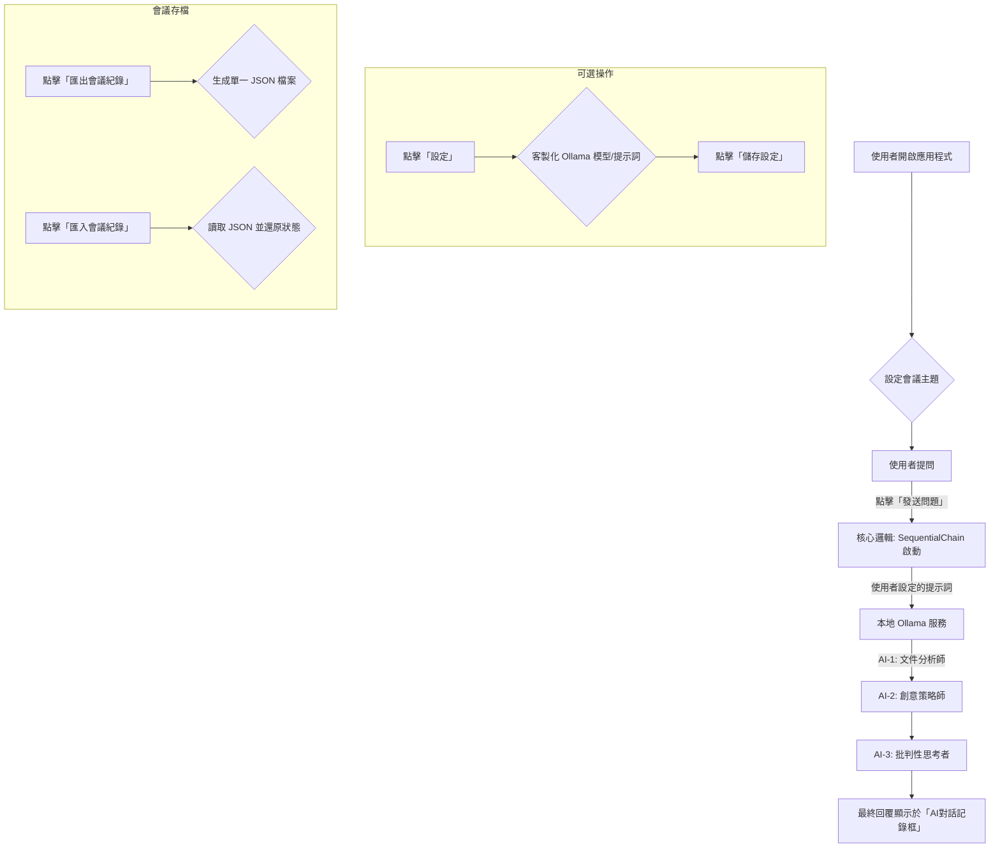

# Insight Cascade v0.2.0

## 專案總覽 (Project Overview)
Insight Cascade 是一個旨在分三階段演進的 AI 專家對話平台。本專案已完成前兩階段，成為一個支援本地 Ollama 模型、具備高度客製化提示詞系統與會議還原功能的單人會議輔助工具。

---

## UI 佈局與功能 (UI Layout & Features)

應用程式介面將使用 Gradio 構建，佈局分為多個主要區塊：

1.  **會議主題**: 設定當前會議的主題。
2.  **中部工作區 (Workspace)**:
    -   **左側：AI 對話記錄框**: 顯示所有 AI 的回覆。
    -   **右側：主席筆記區**: 支援 Markdown 的筆記編輯區，附帶即時預覽。
3.  **控制欄**:
    -   **提問區**: 輸入問題並發送給 AI 鏈。
    -   **會議管理**: 匯出完整會議紀錄、結束會議。
4.  **設定區塊 (可摺疊)**:
    -   **模型設定**: 指定要使用的本地 Ollama 模型名稱 (如 `llama3`)。
    -   **提示詞管理**: 客製化全域及各 AI 角色的提示詞。
    -   **組態管理**: 匯入/匯出包含模型名稱與提示詞的完整設定檔。
5.  **頁腳**:
    -   **匯入會議**: 從先前匯出的 `.json` 檔案還原會議。
    -   **設定按鈕**: 打開或關閉設定區塊。

---

## 核心工作流程 (Core Workflow)



---

## 技術棧 (Tech Stack)

-   **後端框架**: Python FastAPI
-   **前端原型**: Python Gradio
-   **AI 整合**: LangChain (`SequentialChain` with `langchain-community` for Ollama)
-   **本地模型**: Ollama
-   **相依性管理**: `requirements.txt`

---

## 檔案結構 (File Structure)

```
.
├── app.py              # Gradio 介面與 FastAPI 伺服器
├── core_logic.py       # LangChain AI 對話鏈邏輯 (Ollama)
├── file_handler.py     # 檔案匯出/匯入功能
├── requirements.txt    # 專案相依性
└── outputs/            # 存放匯出的 JSON 檔案 (自動生成)
```

---

## 安裝與執行 (Setup & Run)

1.  **安裝與執行 Ollama**:
    -   請先依照 [Ollama 官方網站](https://ollama.com/) 的指示安裝 Ollama。
    -   安裝後，執行以下指令拉取您想使用的模型 (例如 `llama3`):
        ```bash
        ollama pull llama3
        ```
    -   確保 Ollama 服務在背景運行。

2.  **安裝 Python 相依性套件**:
    ```bash
    pip install -r requirements.txt
    ```

3.  **執行應用程式**:
    ```bash
    python app.py
    ```
    應用程式將在本地啟動一個 Gradio 伺服器，可透過瀏覽器訪問。
